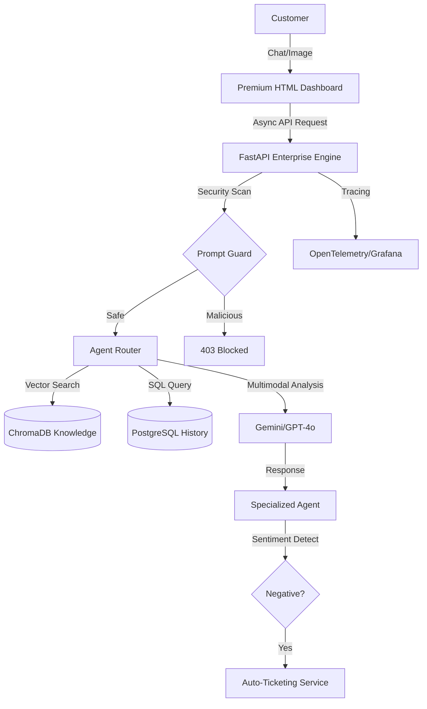

# 🤖 SmartSupport AI: Enterprise Multi-Model Agentic RAG Platform

[](https://github.com/your-repo/actions)
[](https://aquasecurity.github.io/trivy/)
[](https://kind.sigs.k8s.io/)
[](https://fastapi.tiangolo.com/)

SmartSupport AI is a **production-ready, cloud-native** customer support platform. It leverages an advanced **Multi-Model Agentic** framework and a high-performance **RAG (Retrieval-Augmented Generation)** pipeline to provide human-like, accurate, and data-driven support.

---

## 🏗️ System Architecture

### 1. Unified Application Flow


### 2. Infrastructure (Cloud Native)
Deployed on a multi-node **KIND (Kubernetes in Docker)** cluster for enterprise orchestration.

---

## 🚀 Enterprise Features

- **Multi-Model Routing**: Dynamic model switching (Gemini 1.5 Flash/GPT-4o) for optimal cost vs performance.
- **Advanced RAG Pipeline**: Hybrid search across unstructured (PDF/Text) and structured (SQL) data.
- **Vision AI Support**: Direct analysis of package damage or product photos via multimodal LLMs.
- **DevSecOps Ready**: Built-in protection against **Prompt Injection** and automated security scans.
- **LLMOps Observability**: Real-time tracing of agent "thought steps" and token consumption metrics.
- **Async Processing**: Background task workers for heavy document ingestion via Redis Queue.

---

## 🛠️ Tech Stack

- **Frontend**: Vanilla JS (ES6+), Tailwind CSS (via CDN), Glassmorphism UI.
- **Backend**: FastAPI (Asynchronous), Pydantic v2, SQLAlchemy.
- **Vector DB**: ChromaDB (with local-first embeddings).
- **Core DB**: PostgreSQL (SQLite for Local Dev).
- **Automation**: Docker, KIND, GitHub Actions.
- **Monitoring**: Prometheus, Grafana, OpenTelemetry.

---

## 💻 Getting Started

### 1. Prerequisites
- Docker Desktop
- [KIND](https://kind.sigs.k8s.io/)
- Python 3.10+

### 2. Local Setup (Infrastructure)
```bash
# Clone the repository
git clone https://github.com/your-username/smartsupport-ai.git
cd smartsupport-ai

# Start KIND Cluster with Local Registry
bash infra/setup-cluster.sh
```

### 3. Deploy Application
```bash
# Build and load images
docker build -t smartsupport-backend:latest .
kind load docker-image smartsupport-backend:latest --name smartsupport-cluster

# Apply K8s Manifests
kubectl apply -f k8s/namespace.yaml
kubectl apply -f k8s/config.yaml
kubectl apply -f k8s/
```

---

## 🛡️ DevSecOps & Security

| Security Layer | Implementation |
| :--- | :--- |
| **SAST** | Bandit scans for Python vulnerabilities in CI. |
| **Image Scanning** | Trivy automated scans for OS-level vulnerabilities. |
| **Input Sanitization** | Regex-based `PromptGuard` middleware for injection defense. |
| **Secrets** | K8s Secrets for API keys with Base64 encryption. |

---

## 📊 Observability (LLMOps)

- **Tracing**: Access OpenTelemetry traces at `/api/v1/trace`.
- **Metrics**: Real-time Prometheus metrics at `http://localhost:8000/metrics`.
- **Evaluation**: RAG accuracy scoring via `llmops/rag_eval.py`.

---

## 📂 Project Structure

```text
├── k8s/                # Kubernetes Manifests (Deployment, Service, HPA)
├── infra/              # Infrastructure-as-Code (KIND, Setup Scripts)
├── smartsupport_ai/    # Core Application Logic
│   ├── backend/        # FastAPI Async Endpoints
│   ├── core/           # Security, Observability, PromptGuard
│   ├── rag/            # Multi-Model Agents & RAG Engine
│   ├── ingestion/      # Data Pipelines & Vector Indexing
│   └── worker/         # Background Task Processors
├── docs/               # Production Runbooks & Troubleshooting
└── .github/            # CI/CD Workflows (GitHub Actions)
```

---

## 📄 License
This project is licensed under the MIT License - see the [LICENSE](LICENSE) file for details.

---
**Made for Industry-Grade Deployment • Ready for AWS/GCP/Azure K8s**
